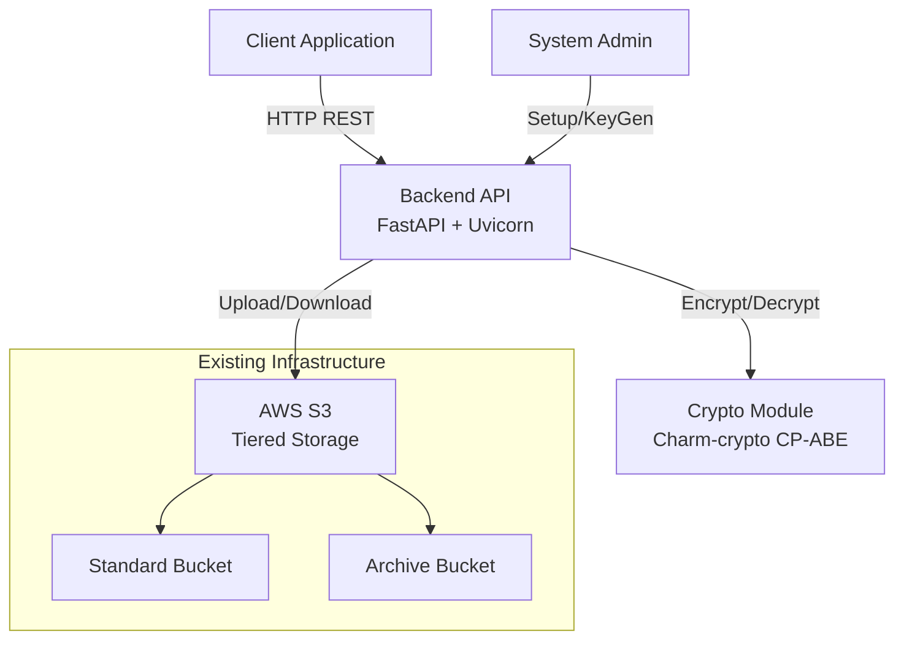
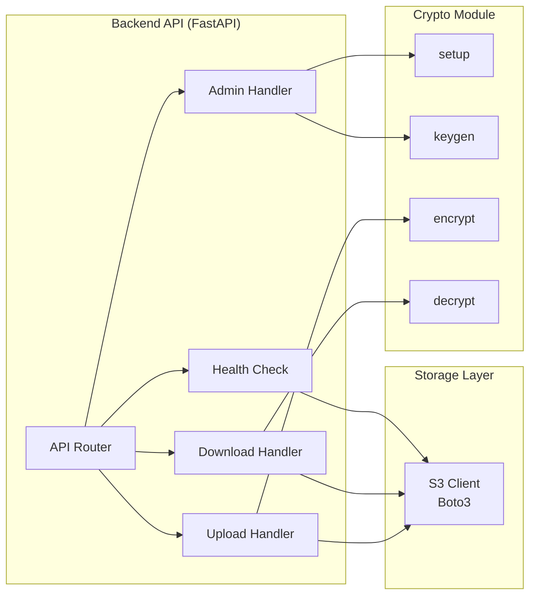
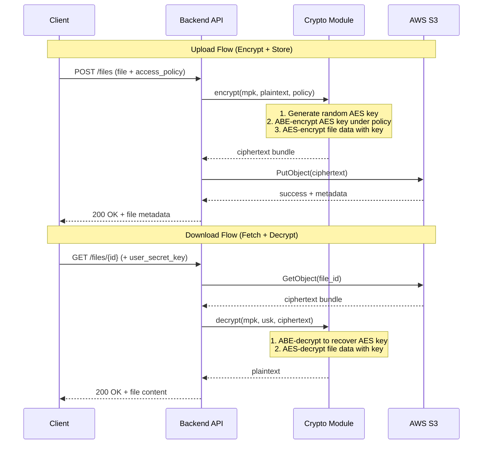
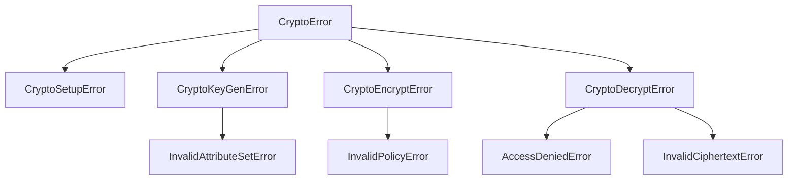

# Design Document: HABE Crypto Backend

## Overview

This document describes the design for a Hierarchical Attribute-Based Encryption (HABE) system combining a core cryptographic module with a backend API server. The system provides fine-grained access control over encrypted files stored in AWS S3, using Ciphertext-Policy Attribute-Based Encryption (CP-ABE) to enforce access policies.

**Key Design Decisions:**

1. **Hybrid Encryption**: ABE encrypts a symmetric AES key (fast for bulk data), while AES-CBC encrypts the actual file content. This avoids the performance penalty of encrypting large files directly with pairing-based cryptography.
2. **Charm-crypto with BSW07 scheme**: Uses the well-established Bethencourt-Sahai-Waters CP-ABE scheme (`CPabe_BSW07`) via Charm-crypto's `HybridABEnc` adapter, which handles the hybrid encryption internally.
3. **FastAPI + Uvicorn**: Chosen for native Python async support, automatic OpenAPI documentation, and seamless integration with Charm-crypto (which is a Python library).
4. **Boto3 for S3**: Standard AWS SDK for Python, leveraging the existing `s3-tiered-storage` Terraform module infrastructure.
5. **In-memory processing**: Plaintext never touches persistent disk storage — all crypto operations happen in RAM or temporary buffers that are explicitly cleared.

## Architecture

### System Context Diagram



### Component Architecture



### Hybrid Encryption Flow



## Components and Interfaces

### Project File Structure

```
habe-crypto-backend/
├── crypto_module/
│   ├── __init__.py
│   ├── core.py              # Setup, KeyGen, Encrypt, Decrypt functions
│   ├── serialization.py     # Key/ciphertext serialization utilities
│   └── exceptions.py        # Custom crypto exceptions
├── backend/
│   ├── __init__.py
│   ├── main.py              # FastAPI app initialization, CORS, lifespan
│   ├── config.py            # Configuration (env vars, S3 settings)
│   ├── routers/
│   │   ├── __init__.py
│   │   ├── files.py         # Upload/Download endpoints
│   │   ├── admin.py         # Setup/KeyGen endpoints
│   │   └── health.py        # Health check endpoint
│   ├── services/
│   │   ├── __init__.py
│   │   ├── crypto_service.py    # Wraps crypto_module for API use
│   │   └── storage_service.py   # S3 interaction via Boto3
│   ├── models/
│   │   ├── __init__.py
│   │   ├── requests.py      # Pydantic request models
│   │   └── responses.py     # Pydantic response models
│   └── exceptions.py        # HTTP exception handlers
├── tests/
│   ├── __init__.py
│   ├── test_crypto_core.py       # Unit tests for crypto operations
│   ├── test_crypto_roundtrip.py  # Property-based round-trip tests
│   ├── test_api_upload.py        # API integration tests (upload)
│   ├── test_api_download.py      # API integration tests (download)
│   └── conftest.py               # Shared fixtures
├── requirements.txt
├── pyproject.toml
└── README.md
```

### Crypto Module Interface

```python
# crypto_module/core.py

from typing import Tuple

class HABECrypto:
    """Core HABE/CP-ABE cryptographic operations using Charm-crypto."""

    def __init__(self, group_name: str = "SS512"):
        """Initialize with a pairing group.
        
        Args:
            group_name: Pairing group identifier (default: SS512)
        """
        ...

    def setup(self) -> Tuple[bytes, bytes]:
        """Generate master public key and master secret key.
        
        Returns:
            Tuple of (master_public_key_bytes, master_secret_key_bytes)
            Both keys are serialized for storage/transmission.
        
        Raises:
            CryptoSetupError: If pairing group initialization fails.
        """
        ...

    def keygen(
        self,
        master_public_key: bytes,
        master_secret_key: bytes,
        attributes: list[str]
    ) -> bytes:
        """Generate a user secret key for a given attribute set.
        
        Args:
            master_public_key: Serialized MPK from setup()
            master_secret_key: Serialized MSK from setup()
            attributes: List of attribute strings (e.g., ["Manager", "Dept_A"])
        
        Returns:
            Serialized user secret key bytes.
        
        Raises:
            InvalidAttributeSetError: If attributes list is empty or contains invalid values.
            CryptoKeyGenError: If key generation fails.
        """
        ...

    def encrypt(
        self,
        master_public_key: bytes,
        plaintext: bytes,
        access_policy: str
    ) -> bytes:
        """Encrypt data under an access policy using hybrid encryption.
        
        Internally:
        1. Generates a random GT element as symmetric key material
        2. ABE-encrypts the GT element under the access policy
        3. Derives AES key from GT element
        4. AES-encrypts the plaintext with the derived key
        5. Bundles ABE ciphertext + AES ciphertext
        
        Args:
            master_public_key: Serialized MPK from setup()
            plaintext: Raw bytes to encrypt (any size)
            access_policy: Boolean formula (e.g., "Manager AND Dept_A")
        
        Returns:
            Serialized ciphertext bundle bytes.
        
        Raises:
            InvalidPolicyError: If access_policy syntax is invalid.
            CryptoEncryptError: If encryption fails.
        """
        ...

    def decrypt(
        self,
        master_public_key: bytes,
        user_secret_key: bytes,
        ciphertext: bytes
    ) -> bytes:
        """Decrypt ciphertext using a user's secret key.
        
        Internally:
        1. Unpacks the ciphertext bundle
        2. ABE-decrypts to recover the GT element
        3. Derives AES key from GT element
        4. AES-decrypts the file data
        
        Args:
            master_public_key: Serialized MPK from setup()
            user_secret_key: Serialized USK from keygen()
            ciphertext: Serialized ciphertext bundle from encrypt()
        
        Returns:
            Original plaintext bytes.
        
        Raises:
            AccessDeniedError: If user attributes don't satisfy the policy.
            InvalidCiphertextError: If ciphertext is corrupted or malformed.
            CryptoDecryptError: If decryption fails for other reasons.
        """
        ...
```

### Backend API Endpoints

| Method | Path | Description | Request Body | Response |
|--------|------|-------------|--------------|----------|
| `POST` | `/admin/setup` | Initialize crypto system | — | `SetupResponse` (MPK, MSK) |
| `POST` | `/admin/keygen` | Generate user key | `KeyGenRequest` | `KeyGenResponse` (USK) |
| `POST` | `/files/upload` | Upload + encrypt file | Multipart (file + metadata) | `UploadResponse` |
| `GET` | `/files/{file_id}` | Download + decrypt file | Headers (USK) | File stream |
| `GET` | `/health` | Health check | — | `HealthResponse` |

### API Endpoint Signatures

```python
# backend/routers/admin.py

@router.post("/admin/setup", response_model=SetupResponse)
async def setup_crypto() -> SetupResponse:
    """Initialize the HABE crypto system. Returns MPK and MSK."""
    ...

@router.post("/admin/keygen", response_model=KeyGenResponse)
async def generate_user_key(request: KeyGenRequest) -> KeyGenResponse:
    """Generate a user secret key for the given attributes."""
    ...
```

```python
# backend/routers/files.py

@router.post("/files/upload", response_model=UploadResponse)
async def upload_file(
    file: UploadFile,
    access_policy: str = Form(...),
    master_public_key: str = Form(...),
    storage_tier: str = Form(default="standard")
) -> UploadResponse:
    """Encrypt and upload a file to S3."""
    ...

@router.get("/files/{file_id}")
async def download_file(
    file_id: str,
    x_user_secret_key: str = Header(...),
    x_master_public_key: str = Header(...)
) -> StreamingResponse:
    """Download and decrypt a file from S3."""
    ...
```

```python
# backend/routers/health.py

@router.get("/health", response_model=HealthResponse)
async def health_check() -> HealthResponse:
    """Check API and S3 connectivity status."""
    ...
```

## Data Models

### Key Structures

```python
# Serialized format for keys (base64-encoded JSON with Charm serialization)

# Master Public Key (MPK) - safe to distribute
{
    "scheme": "CP-ABE-BSW07",
    "group": "SS512",
    "key_data": "<base64-encoded Charm objectToBytes output>"
}

# Master Secret Key (MSK) - must be kept secret
{
    "scheme": "CP-ABE-BSW07",
    "group": "SS512",
    "key_data": "<base64-encoded Charm objectToBytes output>"
}

# User Secret Key (USK) - issued per user
{
    "scheme": "CP-ABE-BSW07",
    "group": "SS512",
    "attributes": ["Manager", "Dept_A"],
    "key_data": "<base64-encoded Charm objectToBytes output>"
}
```

### Ciphertext Bundle Format

```python
# Stored as a single blob in S3
# Format: MessagePack-encoded structure for efficient binary handling

{
    "version": 1,
    "scheme": "CP-ABE-BSW07-HYBRID",
    "access_policy": "Manager AND Dept_A",
    "abe_ciphertext": "<base64-encoded ABE ciphertext of symmetric key>",
    "aes_ciphertext": "<base64-encoded AES-CBC encrypted file data>",
    "aes_iv": "<base64-encoded 16-byte IV>",
    "hmac": "<base64-encoded HMAC-SHA256 of aes_ciphertext>",
    "metadata": {
        "original_filename": "report.pdf",
        "original_size": 1048576,
        "content_type": "application/pdf",
        "encrypted_at": "2024-01-15T10:30:00Z"
    }
}
```

### API Request/Response Schemas

```python
# backend/models/requests.py
from pydantic import BaseModel, Field

class KeyGenRequest(BaseModel):
    master_public_key: str = Field(..., description="Base64-encoded MPK")
    master_secret_key: str = Field(..., description="Base64-encoded MSK")
    attributes: list[str] = Field(
        ..., 
        min_length=1,
        description="User attribute set, e.g. ['Manager', 'Dept_A']"
    )

# backend/models/responses.py
from pydantic import BaseModel
from datetime import datetime

class SetupResponse(BaseModel):
    master_public_key: str  # Base64-encoded
    master_secret_key: str  # Base64-encoded
    scheme: str = "CP-ABE-BSW07"
    group: str = "SS512"

class KeyGenResponse(BaseModel):
    user_secret_key: str  # Base64-encoded
    attributes: list[str]

class UploadResponse(BaseModel):
    file_id: str
    filename: str
    size_bytes: int
    storage_tier: str
    access_policy: str
    uploaded_at: datetime

class ErrorResponse(BaseModel):
    error_code: str
    message: str
    timestamp: datetime

class HealthResponse(BaseModel):
    status: str  # "healthy" | "degraded" | "unhealthy"
    s3_connected: bool
    crypto_module_ready: bool
    timestamp: datetime
```

### S3 Object Key Convention

```
{storage_tier}/{file_id}.enc

Examples:
  standard/550e8400-e29b-41d4-a716-446655440000.enc
  archive/7c9e6679-7425-40de-944b-e07fc1f90ae7.enc
```

Metadata stored as S3 object tags:
- `original_filename`: Original file name
- `access_policy`: The policy string (for reference, not security)
- `encrypted_at`: ISO 8601 timestamp
- `content_type`: Original MIME type


## Correctness Properties

*A property is a characteristic or behavior that should hold true across all valid executions of a system — essentially, a formal statement about what the system should do. Properties serve as the bridge between human-readable specifications and machine-verifiable correctness guarantees.*

### Property 1: Encryption Round-Trip

*For any* valid plaintext (binary data of any size including empty), *for any* valid access policy using AND/OR operators, and *for any* attribute set that satisfies that policy, encrypting the plaintext under the policy and then decrypting with a key generated for the satisfying attribute set SHALL return bytes identical to the original plaintext.

**Validates: Requirements 4.4, 5.1, 5.2, 5.4, 3.2, 3.3, 3.6**

### Property 2: Access Denial for Non-Satisfying Attributes

*For any* valid access policy and *for any* attribute set that does NOT satisfy that policy, attempting to decrypt a ciphertext encrypted under that policy with a key generated for the non-satisfying attribute set SHALL raise an AccessDeniedError.

**Validates: Requirements 2.5, 3.5, 4.3, 5.3**

### Property 3: Setup Produces Distinct Key Pairs

*For any* two invocations of the Setup() function, the resulting master key pairs SHALL be distinct (both MPK and MSK differ between invocations).

**Validates: Requirements 1.5**

### Property 4: Invalid Inputs Are Rejected

*For any* empty or invalid attribute set (empty list, whitespace-only strings), KeyGen SHALL raise an InvalidAttributeSetError. *For any* syntactically invalid access policy string (unbalanced parentheses, missing operators, empty string), Encrypt SHALL raise an InvalidPolicyError.

**Validates: Requirements 2.4, 3.4**

### Property 5: Corrupted Ciphertext Detection

*For any* valid ciphertext, if one or more bytes are modified (corrupted), attempting to decrypt the corrupted ciphertext SHALL raise an InvalidCiphertextError rather than returning incorrect plaintext.

**Validates: Requirements 4.5**

### Property 6: Error Response Format Consistency

*For any* API request that triggers an error condition (400, 401, 403, 404, 413, 500, 503), the response body SHALL conform to the ErrorResponse schema containing exactly: error_code (string), message (string), and timestamp (ISO 8601 datetime).

**Validates: Requirements 10.4**

## Error Handling

### Error Hierarchy



### Crypto Module Exceptions

| Exception | Trigger | HTTP Mapping |
|-----------|---------|--------------|
| `CryptoSetupError` | Pairing group initialization failure | 500 |
| `InvalidAttributeSetError` | Empty or invalid attribute list | 400 |
| `CryptoKeyGenError` | Key generation failure | 500 |
| `InvalidPolicyError` | Malformed access policy syntax | 400 |
| `CryptoEncryptError` | Encryption operation failure | 500 |
| `AccessDeniedError` | Attributes don't satisfy policy | 403 |
| `InvalidCiphertextError` | Corrupted or malformed ciphertext | 400 |
| `CryptoDecryptError` | Other decryption failure | 500 |

### Backend API Error Handling Strategy

1. **Input Validation Layer** (FastAPI/Pydantic):
   - Missing required fields → 400 with field-level error details
   - Invalid file size → 413
   - Missing auth headers → 401

2. **Crypto Layer** (exception mapping):
   - `InvalidAttributeSetError` → 400
   - `InvalidPolicyError` → 400
   - `AccessDeniedError` → 403
   - `InvalidCiphertextError` → 400
   - Other `CryptoError` → 500

3. **Storage Layer** (Boto3 exceptions):
   - `NoSuchKey` → 404
   - `ClientError` (access denied) → 500
   - Connection errors → 503
   - Other S3 errors → 500 with generic message

4. **Global Exception Handler**:
   - All unhandled exceptions → 500 with generic message
   - Sensitive data (keys, plaintext) NEVER included in error responses
   - All error responses use `ErrorResponse` schema with timestamp

### Error Response Format

```json
{
    "error_code": "INVALID_POLICY",
    "message": "Access policy syntax error: unbalanced parentheses at position 15",
    "timestamp": "2024-01-15T10:30:00Z"
}
```

Error codes follow the pattern: `{CATEGORY}_{SPECIFIC}`, e.g.:
- `INVALID_POLICY`, `INVALID_ATTRIBUTES`, `INVALID_CIPHERTEXT`
- `ACCESS_DENIED`
- `FILE_NOT_FOUND`, `FILE_TOO_LARGE`
- `S3_UNAVAILABLE`, `S3_UPLOAD_FAILED`, `S3_DOWNLOAD_FAILED`
- `CRYPTO_SETUP_FAILED`, `CRYPTO_ENCRYPT_FAILED`, `CRYPTO_DECRYPT_FAILED`
- `MISSING_FILE`, `MISSING_POLICY`, `MISSING_AUTH`

## Testing Strategy

### Testing Framework

- **Unit/Integration Tests**: `pytest` with `pytest-asyncio` for async endpoint testing
- **Property-Based Tests**: `hypothesis` (Python PBT library)
- **S3 Mocking**: `moto` (AWS service mocking library)
- **API Testing**: `httpx` with FastAPI's `TestClient`

### Test Categories

#### 1. Property-Based Tests (Crypto Module)

Each correctness property is implemented as a single Hypothesis test with minimum 100 iterations.

| Property | Test File | Strategy |
|----------|-----------|----------|
| Property 1: Round-trip | `test_crypto_roundtrip.py` | Generate random bytes (0-10KB), random valid policies, matching attribute sets |
| Property 2: Access denial | `test_crypto_roundtrip.py` | Generate random policies and non-satisfying attribute sets |
| Property 3: Distinct keys | `test_crypto_roundtrip.py` | Call setup() multiple times, compare results |
| Property 4: Invalid inputs | `test_crypto_roundtrip.py` | Generate invalid attribute sets and policy strings |
| Property 5: Corruption detection | `test_crypto_roundtrip.py` | Generate valid ciphertext, corrupt random bytes |
| Property 6: Error format | `test_api_upload.py` | Generate various invalid requests, verify response schema |

**Configuration:**
```python
from hypothesis import settings, given, strategies as st

@settings(max_examples=100)
@given(
    plaintext=st.binary(min_size=0, max_size=10240),
    # ... other strategies
)
def test_encryption_round_trip(plaintext, ...):
    # Feature: habe-crypto-backend, Property 1: Encryption Round-Trip
    ...
```

**Custom Strategies:**
- `valid_attribute_set()`: Generates lists of 1-5 uppercase alphanumeric attribute strings
- `valid_access_policy(attributes)`: Generates boolean formulas using AND/OR over given attributes
- `satisfying_attributes(policy)`: Generates attribute sets that satisfy a given policy
- `non_satisfying_attributes(policy)`: Generates attribute sets that do NOT satisfy a given policy

#### 2. Unit Tests (Crypto Module)

- `test_crypto_core.py`: Specific examples for each operation
  - Setup returns two non-empty byte sequences
  - KeyGen with known attributes produces a key
  - Encrypt with known policy produces ciphertext
  - Decrypt with matching key returns original data
  - Hierarchical attributes work correctly
  - Edge cases: empty file, large file, single attribute, many attributes

#### 3. Integration Tests (Backend API)

- `test_api_upload.py`: Upload endpoint tests with mocked S3
  - Successful upload returns metadata
  - Missing file → 400
  - Missing policy → 400
  - Invalid policy → 400
  - S3 failure → 500
  - File too large → 413

- `test_api_download.py`: Download endpoint tests with mocked S3
  - Successful download returns file content
  - Non-matching key → 403
  - File not found → 404
  - Missing auth header → 401
  - S3 failure → 500

- End-to-end: Upload then download, verify content matches original

#### 4. Health Check Tests

- S3 reachable → 200 healthy
- S3 unreachable → 503 unhealthy

### Test Execution

```bash
# All tests
pytest

# Property-based tests only
pytest tests/test_crypto_roundtrip.py -v

# Integration tests only
pytest tests/test_api_upload.py tests/test_api_download.py -v

# With coverage
pytest --cov=crypto_module --cov=backend --cov-report=html
```
