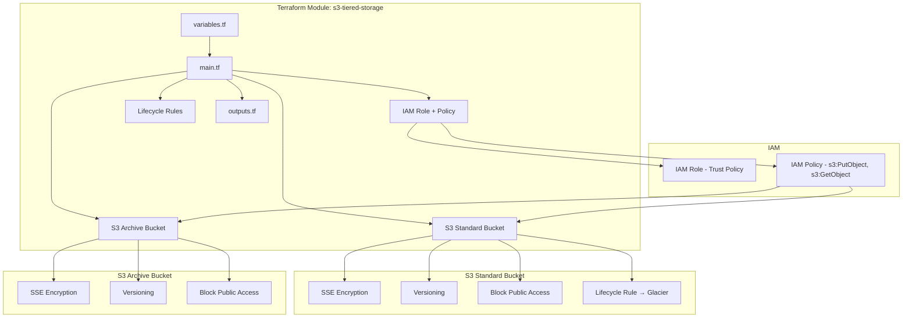

# Design Document: S3 Tiered Storage

## Overview

This design describes a Terraform module that provisions AWS S3 tiered storage infrastructure. The module creates two S3 buckets (Standard and Archive), configures lifecycle rules for automatic data tiering from Standard to Glacier, and sets up IAM roles with least-privilege access for backend services.

The module follows Terraform best practices: modular structure, input validation, configurable variables with sensible defaults, and comprehensive outputs for integration with other modules.

## Architecture



### Design Decisions

1. **Separate buckets instead of single bucket with prefixes**: Provides clearer separation of concerns, independent lifecycle management, and simpler IAM policies scoped to specific ARNs.

2. **Lifecycle rule on Standard Bucket only**: Objects are transitioned in-place from STANDARD to GLACIER storage class within the same bucket, which is the standard AWS pattern for cost optimization.

3. **AES-256 (SSE-S3) as default encryption**: Simpler setup with no KMS key management overhead. Users can override to SSE-KMS via variable if needed.

4. **Configurable trust policy principal**: The IAM role trust policy accepts a configurable principal (AWS service or account) to support different backend service architectures.

## Components and Interfaces

### Module File Structure

```
modules/s3-tiered-storage/
├── main.tf           # Primary resource definitions
├── variables.tf      # Input variable declarations with validation
├── outputs.tf        # Output value declarations
├── versions.tf       # Terraform and provider version constraints
└── README.md         # Module documentation
```

### Resource Components

#### 1. Standard Bucket (`aws_s3_bucket`)

- Creates the primary bucket for frequently accessed data
- Associated resources:
  - `aws_s3_bucket_versioning` — enables versioning
  - `aws_s3_bucket_server_side_encryption_configuration` — AES-256 or KMS encryption
  - `aws_s3_bucket_public_access_block` — blocks all public access
  - `aws_s3_bucket_lifecycle_configuration` — transition to Glacier

#### 2. Archive Bucket (`aws_s3_bucket`)

- Creates the secondary bucket for infrequently accessed data
- Associated resources:
  - `aws_s3_bucket_versioning` — enables versioning
  - `aws_s3_bucket_server_side_encryption_configuration` — AES-256 or KMS encryption
  - `aws_s3_bucket_public_access_block` — blocks all public access

#### 3. IAM Role (`aws_iam_role`)

- Trust policy allowing the configured principal to assume the role
- Associated resources:
  - `aws_iam_policy` — scoped to s3:PutObject and s3:GetObject on both buckets
  - `aws_iam_role_policy_attachment` — attaches policy to role

### Interfaces

#### Input Variables

| Variable | Type | Default | Description |
|----------|------|---------|-------------|
| `bucket_name_prefix` | `string` | (required) | Prefix for bucket names |
| `lifecycle_transition_days` | `number` | `30` | Days before transitioning to Glacier |
| `aws_region` | `string` | (required) | AWS region for resources |
| `environment` | `string` | `"dev"` | Environment tag value |
| `trusted_principal` | `string` | (required) | ARN of the principal allowed to assume the IAM role |
| `encryption_type` | `string` | `"AES256"` | Encryption type: "AES256" or "aws:kms" |
| `kms_key_arn` | `string` | `""` | KMS key ARN (required if encryption_type is "aws:kms") |
| `tags` | `map(string)` | `{}` | Additional tags to apply to all resources |

#### Outputs

| Output | Description |
|--------|-------------|
| `standard_bucket_arn` | ARN of the Standard S3 bucket |
| `standard_bucket_id` | ID/name of the Standard S3 bucket |
| `archive_bucket_arn` | ARN of the Archive S3 bucket |
| `archive_bucket_id` | ID/name of the Archive S3 bucket |
| `iam_role_arn` | ARN of the IAM role |
| `iam_role_name` | Name of the IAM role |
| `iam_policy_arn` | ARN of the IAM policy |

## Data Models

### Resource Naming Convention

```
{bucket_name_prefix}-standard-{random_suffix}
{bucket_name_prefix}-archive-{random_suffix}
{bucket_name_prefix}-backend-role
{bucket_name_prefix}-s3-access-policy
```

### Default Tags Applied to All Resources

```hcl
{
  Environment = var.environment
  ManagedBy   = "terraform"
}
```

These are merged with any user-provided tags via the `tags` variable.

### IAM Policy Document Structure

```json
{
  "Version": "2012-10-17",
  "Statement": [
    {
      "Effect": "Allow",
      "Action": [
        "s3:PutObject",
        "s3:GetObject"
      ],
      "Resource": [
        "arn:aws:s3:::{standard_bucket}/*",
        "arn:aws:s3:::{archive_bucket}/*"
      ]
    }
  ]
}
```

### Lifecycle Rule Configuration

```hcl
rule {
  id     = "transition-to-glacier"
  status = "Enabled"

  transition {
    days          = var.lifecycle_transition_days
    storage_class = "GLACIER"
  }
}
```

## Error Handling

### Input Validation Rules

1. **`bucket_name_prefix`**: Must match regex `^[a-z0-9-]+$` (lowercase letters, numbers, hyphens only). This ensures S3 bucket naming compliance.

2. **`lifecycle_transition_days`**: Must be >= 1. Prevents invalid lifecycle configurations that AWS would reject.

3. **`encryption_type`**: Must be one of `"AES256"` or `"aws:kms"`. Prevents misconfiguration.

4. **`kms_key_arn`**: If `encryption_type` is `"aws:kms"`, this must be non-empty. Validated via precondition.

### Terraform Plan-Time Errors

- Invalid variable values are caught at `terraform plan` time via `validation` blocks
- Missing required variables produce clear error messages
- Provider version mismatches are caught by `required_providers` block

### Runtime Considerations

- Bucket name conflicts (globally unique requirement) will produce AWS API errors at apply time
- IAM propagation delays may cause temporary access denied errors (eventual consistency)

## Testing Strategy

### Why Property-Based Testing Does Not Apply

This feature is Infrastructure as Code (Terraform). IaC is declarative configuration, not functions with inputs/outputs that vary meaningfully. The resources are either created correctly or not — there is no input space to explore with randomized testing. The appropriate testing strategies are:

1. **Static validation**: `terraform validate` and `terraform fmt`
2. **Plan-based assertions**: Verify the plan output contains expected resources and configurations
3. **Policy compliance checks**: Use tools like `tflint`, `checkov`, or `tfsec` for security/compliance
4. **Integration tests**: Use Terratest or similar to provision real infrastructure and verify

### Test Approach

#### 1. Static Analysis
- `terraform validate` — syntax and configuration correctness
- `terraform fmt -check` — formatting compliance
- `tflint` — Terraform-specific linting rules

#### 2. Unit Tests (Terraform Plan Assertions)
- Verify Standard Bucket is created with correct encryption configuration
- Verify Archive Bucket is created with correct encryption configuration
- Verify both buckets have versioning enabled
- Verify both buckets have Block Public Access enabled (all 4 settings)
- Verify lifecycle rule is configured with correct transition days
- Verify IAM role has correct trust policy
- Verify IAM policy contains only s3:PutObject and s3:GetObject
- Verify IAM policy resource scope is limited to both bucket ARNs
- Verify input validation rejects invalid bucket_name_prefix
- Verify input validation rejects lifecycle_transition_days < 1

#### 3. Integration Tests (Terratest)
- Provision the module in a test AWS account
- Verify buckets exist and are accessible
- Verify encryption is active on both buckets
- Verify public access is blocked
- Verify IAM role can perform PutObject and GetObject
- Verify IAM role cannot perform other S3 operations (e.g., DeleteObject, ListBucket)
- Clean up all resources after test

#### 4. Security/Compliance Checks
- `checkov` or `tfsec` scan for security misconfigurations
- Verify no public access paths exist
- Verify encryption is enforced
- Verify IAM follows least privilege principle
