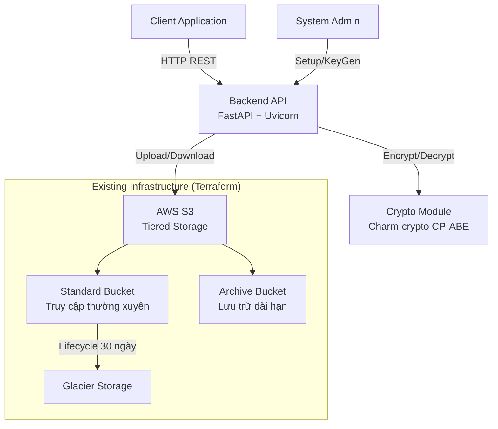
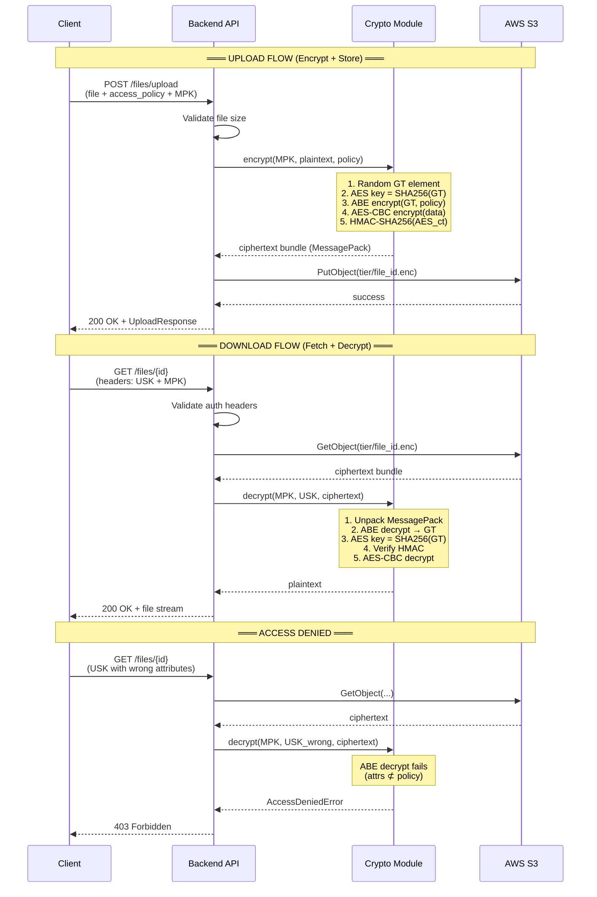
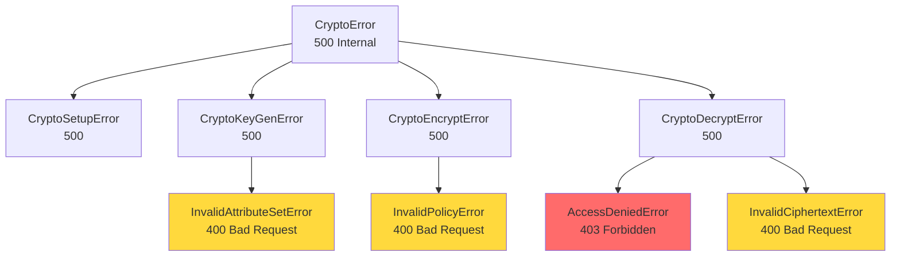
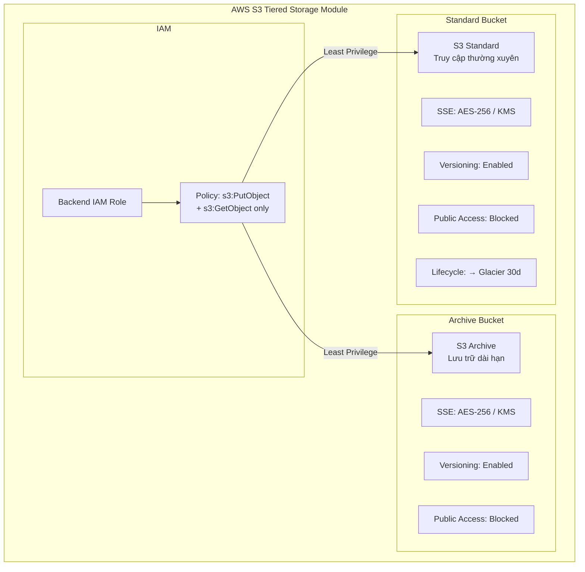
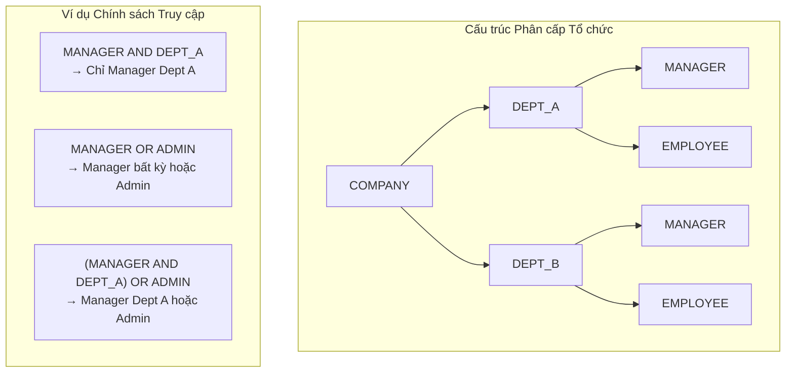

# Kiến trúc Hệ thống — HABE Crypto Backend

## 1. System Context Diagram



## 2. Component Architecture

```mermaid
graph LR
    subgraph "Backend API (FastAPI)"
        Router[API Router]
        Upload[POST /files/upload]
        Download["GET /files/:id"]
        AdminSetup[POST /admin/setup]
        AdminKeygen[POST /admin/keygen]
        Health[GET /health]
        Router --> Upload
        Router --> Download
        Router --> AdminSetup
        Router --> AdminKeygen
        Router --> Health
    end

    subgraph "Crypto Module (charm-crypto)"
        Setup[setup&#40;&#41; → MPK, MSK]
        KeyGen[keygen&#40;MPK, MSK, attrs&#41; → USK]
        Encrypt[encrypt&#40;MPK, data, policy&#41; → CT]
        Decrypt[decrypt&#40;MPK, USK, CT&#41; → data]
    end

    subgraph "Storage Layer (Boto3)"
        S3Client[S3 Client]
        StdBucket[Standard Bucket]
        ArcBucket[Archive Bucket]
        S3Client --> StdBucket
        S3Client --> ArcBucket
    end

    Upload --> Encrypt
    Download --> Decrypt
    AdminSetup --> Setup
    AdminKeygen --> KeyGen
    Upload --> S3Client
    Download --> S3Client
    Health --> S3Client
```



## 3. Hybrid Encryption Flow



## 4. Cấu trúc Ciphertext Bundle

```mermaid
graph TD
    subgraph "Ciphertext Bundle (MessagePack)"
        V[version: 1]
        S[scheme: CP-ABE-BSW07-HYBRID]
        P[access_policy: "Manager AND Dept_A"]
        ABE[abe_ciphertext: base64<br/>ABE encrypted GT element]
        AES[aes_ciphertext: base64<br/>AES-256-CBC encrypted data]
        IV[aes_iv: base64<br/>16-byte random IV]
        HMAC[hmac: base64<br/>HMAC-SHA256 of aes_ciphertext]
        META[metadata: dict<br/>original_size, filename, ...]
    end
```

## 5. Exception Hierarchy



## 6. Tiered Storage Architecture (Terraform)



## 7. Thuộc tính Phân cấp (Hierarchical Attributes)



## 8. Security Layers

```
┌─────────────────────────────────────────────────────────┐
│                    CLIENT SIDE                            │
│  • Access Policy enforcement (CP-ABE)                    │
│  • Attribute-based key management                        │
├─────────────────────────────────────────────────────────┤
│                    TRANSPORT                              │
│  • HTTPS/TLS encryption                                  │
│  • Base64 key encoding for HTTP headers                  │
├─────────────────────────────────────────────────────────┤
│                    APPLICATION (Backend API)              │
│  • Input validation (Pydantic)                           │
│  • File size limits                                      │
│  • CORS configuration                                    │
│  • Error sanitization (no sensitive data in responses)   │
│  • In-memory processing (no plaintext on disk)           │
├─────────────────────────────────────────────────────────┤
│                    ENCRYPTION (Crypto Module)             │
│  • CP-ABE BSW07 (attribute-based access control)         │
│  • AES-256-CBC (bulk data encryption)                    │
│  • HMAC-SHA256 (integrity verification)                  │
│  • Secure random (os.urandom for keys/IVs)              │
├─────────────────────────────────────────────────────────┤
│                    STORAGE (AWS S3)                       │
│  • Server-Side Encryption (SSE-S3 / SSE-KMS)            │
│  • Bucket versioning                                     │
│  • Block public access                                   │
│  • IAM least privilege (PutObject + GetObject only)      │
│  • Lifecycle rules (Standard → Glacier)                  │
└─────────────────────────────────────────────────────────┘
```
